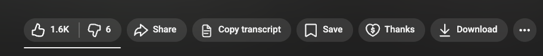
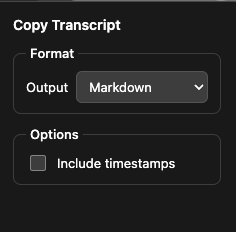

# Copy YouTube Transcript

A **Chrome** (Manifest V3) browser extension that copies **YouTube video captions/transcripts** to the clipboard from the watch page — optionally with timestamps, as **plain text** or **Markdown**.

Licensed under the [MIT License](LICENSE).

## Screenshots

**YouTube watch page** — the extension adds **Copy transcript** next to Share, Save, and other actions.

**Extension popup** — choose **Plain text** or **Markdown**, and toggle **Include timestamps**.

## Features

- **“Copy transcript” button** in the action bar below the video (next to Share, Save, etc.) when a transcript is available
- **No need to open** YouTube’s transcript panel separately; captions are loaded in the background and copied on click
- **Settings** in the extension popup:
  - **Output:** Plain text or Markdown (bullet lists with `-`)
  - **Timestamps:** optional (`[mm:ss]` or `[hh:mm:ss]` for long videos)
- Settings are stored with `chrome.storage.sync` (synced across devices when signed into Chrome)
- If **no captions/transcript** exists, the button shows a disabled state (“No transcript”)

## Requirements

- A **Chromium-based browser** with Manifest V3 support (e.g. Google Chrome, Microsoft Edge, Brave)
- Used on **youtube.com** only (the extension is active there)

## Install from source (developer mode)

1. Clone the repository or download and unpack the ZIP.
2. Open **Manage extensions** in your browser:
   - Chrome: `chrome://extensions`
   - Edge: `edge://extensions`
3. Enable **Developer mode**.
4. Click **Load unpacked** and select the folder that contains `manifest.json` (project root).

After installation, on a YouTube watch page (`youtube.com/watch?v=…`), the button appears once the page has loaded.

## Usage

1. Open a video that has captions (auto-generated or manual).
2. Click **Copy transcript** — the text is copied to the clipboard.
3. Adjust format and timestamps in the extension **popup** (click the extension icon) if needed.

## Permissions

| Permission | Purpose |
|------------|---------|
| `storage` | Save popup settings (format, timestamps). |
| `clipboardWrite` | Write the transcript to the clipboard (via the background service worker). |
| `*://*.youtube.com/*` (host) | Scripts and network access only on YouTube domains for captions and the InnerTube API. |

No data is sent to third-party servers operated by this extension; requests run in the YouTube context (cookies/session as in the browser).

## Technical overview

- **`manifest.json`** — Manifest V3, content script, service worker, popup
- **`content.js`** — UI button, player/caption metadata, fetching captions (e.g. timedtext / json3), formatting
- **`content.css`** — Button styling
- **`background.js`** — Service worker for `navigator.clipboard.writeText`
- **`popup.html` / `popup.js`** — Settings

No build step: plain HTML/CSS/JS, load directly.

## Contributing & issues

Issues and pull requests are welcome. For bugs, please include when possible:

- Browser and version  
- Link or video ID  
- Whether captions are visible in the YouTube UI  
- Expected vs. actual behavior  

## License

Distributed under the MIT License. See [LICENSE](LICENSE).

---

*YouTube is a trademark of Google LLC. This project is not affiliated with or endorsed by Google.*
